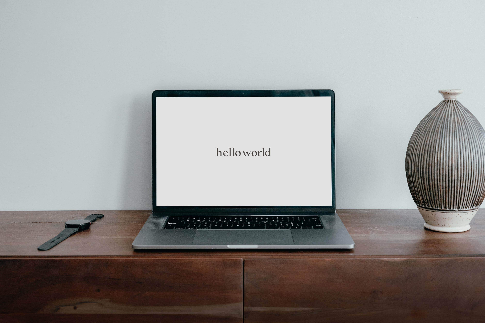

一转眼，8 年过去了。博客就这么荒废了好久。

本来是用 Netlify，把这个基于 Hexo 的博客给复活了。但是找主题的时候，发现大部分都没怎么维护了，一直没找到满意的，足够简洁的。

于是最近在本地尝试了 Hugo，Gastby。最后，看到[Randy's Blog](https://www.lutaonan.com/blog/)基于 Eleventy 搭建的样子，非常喜欢，就有了现在的样子。最终和用的 Hexo 主题[hexo-theme-oasis](https://github.com/qiantao94/hexo-theme-oasis)非常像，但是自定义起来简单了许多。本来用着 Netlify 来驱动的，但想着域名和 CDN 都用着 Cloudflare 了，就叛逃到了 Cloudflare Pages 了。Cloudflare 的后台交互非常直观，域名收费也都是最低价格。

### Hugo 痛点
- Hexo 的 markdown 文件，不能无痛的转移。比如 date，tags，都需要额外处理。
- 写 markdown 时，希望能直接预览本地图片，而且发布后图片也显示正常。花费了快一个小时，也没找到适合的方法。

### Gastby 痛点
- Hexo 的 markdown 文件也不能平滑的转移。
- 结构太复杂了，抓取数据居然还是通过 GraphQL 的。杀鸡不需要用牛刀。
- 看中的主题[gatsby-starter-lumen](https://github.com/alxshelepenok/gatsby-starter-lumen)很久没维护了。本地跑起来也是需要各种小的 fix。想快速定制一下，发现没那么简单。

Eleventy 整体就清爽太多了，看看目录下的 config 数量就很放松。预览图片的问题，翻了翻文档，一行代码就解决了。
```
  config.addPassthroughCopy({"images/": "blog/images/"});
```

再次提醒自己[不要一直使用新工具](https://www.6path.com/blog/no-more-tools/)。博客是用来记录，用来输出的。希望下一次改版也是 8 年之后吧，但是这之间，还是默默的输出吧。
