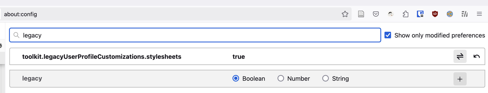
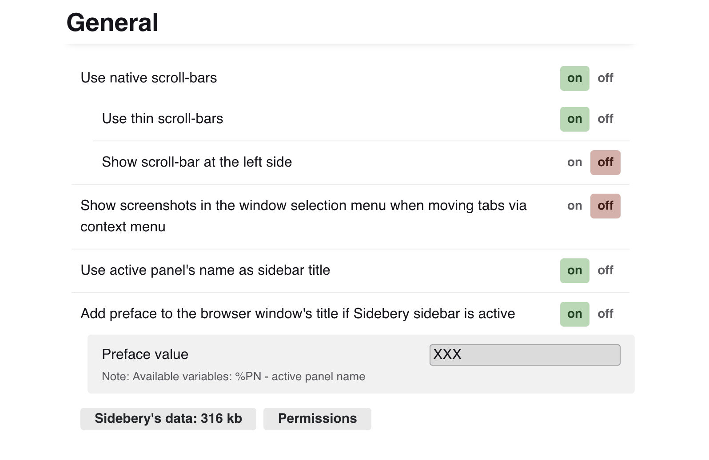

## 前提条件

1. ### `about: config` 里开启使用 userChrome 的设置



2. ### 安装 [Sidebery](https://addons.mozilla.org/en-US/firefox/addon/sidebery/)


## 步骤

### 创建 `userChrome.css`

在 UserProfile 目录下创建 chrome 目录，然后在里面创建 `userChrome.css`。

注意 css 里面是依赖 `titlepreface` 的。

```css
/**
 * Dynamic Horizontal Tabs Toolbar (without animations)
 * sidebar.verticalTabs: false (with native horizontal tabs)
 */
#main-window #TabsToolbar > .toolbar-items { overflow: hidden; }
 /* Hidden state: Hide native tabs strip */
#main-window[titlepreface*="XXX"] #TabsToolbar > .toolbar-items { height: 0 !important; }
/* Hidden state: Fix z-index of active pinned tabs */
#main-window[titlepreface*="XXX"] #tabbrowser-tabs { z-index: 0 !important; }
/* Hidden state: Hide window buttons in tabs-toolbar */
#main-window[titlepreface*="XXX"] #TabsToolbar .titlebar-spacer,
#main-window[titlepreface*="XXX"] #TabsToolbar .titlebar-buttonbox-container {
  display: none !important;
}
/* [Optional] Uncomment block below to show window buttons in nav-bar (maybe, I didn't test it on non-linux-i3wm env) */
/* #main-window[titlepreface*="XXX"] #nav-bar > .titlebar-buttonbox-container,
#main-window[titlepreface*="XXX"] #nav-bar > .titlebar-buttonbox-container > .titlebar-buttonbox {
  display: flex !important;
} */
/* [Optional] Uncomment one of the line below if you need space near window buttons */
/* #main-window[titlepreface*="XXX"] #nav-bar > .titlebar-spacer[type="pre-tabs"] { display: flex !important; } */
/* #main-window[titlepreface*="XXX"] #nav-bar > .titlebar-spacer[type="post-tabs"] { display: flex !important; } */
```

### 在 Sidebery 设置 titlepreface 值

用的值是 `XXX`，是要和上面的 css 用的值一样的。



## 参考文档

[Firefox Styles Snippets (via userChrome.css) · mbnuqw/sidebery Wiki · GitHub](https://github.com/mbnuqw/sidebery/wiki/Firefox-Styles-Snippets-(via-userChrome.css))