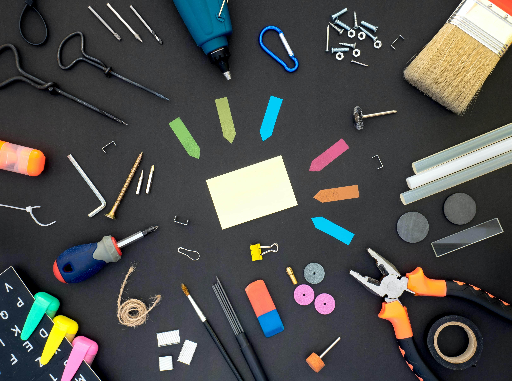

## 背景

不知道有没有人和我一样，有工具癖。有时候为了选一个写文本的工具，或者一个稍后阅读的软件，会花费大量的时间去研究、对比。选中后，又会去看文章、视频去深度了解如何高效的使用。时间和精力花费了很多，却忘记了初衷，忘记了有效的输入内容，输出文字。

如果你也是这样，那就从这篇文章学习下吧。我们需要设计我们工作的方法，而不是一直找寻工作用的新工具。与其一直纠结什么GTD软件最适合，还不如拿着纸和笔开始计划，投入工作吧。

原文[No New Tools](https://frankchimero.com/blog/no-new-tools/)已经404了，在这还能找到[存档](https://web.archive.org/web/20140430162532/https://frankchimero.com/blog/no-new-tools/)。

---

## 原文翻译
作为一个工具的早期用户是令人振奋的，就像坐过山车让你感觉是在旅行一样。你在移动，但你实际上并没有去任何地方，你只是在设计越来越复杂的方法让你自我感觉良好。你处于生产力的循环之中，为了改变而改变。我在一月份和自己达成了一个协议：不在我的手机或电脑上安装新的应用程序。不要做新的东西。只做你的工作。

文本编辑器、电子表格、电子邮件、铅笔、纸张、Photoshop。好了。这就够了。

让我们来谈谈制作工具的问题。我们做的东西应该是减少痛苦，增加快乐，或者做一些两者的混合。如果你真的擅长目标A，你可以免费获得一点目标B。如果你不知道如何做到这两点，你就是在玩装扮游戏。**我越来越觉得我的很多工具都是在装扮成工具，因为它们并没有提供任何节省时间或精力的方法，只是用稍微不同的方法将信息从一个桶里无意识地转移到另一个桶里。**如果一个桶里有一个洞，你就会得到另一个更小的桶，来捕捉从第一个桶里的洞里出来的东西。这样不断地有更多的洞和桶，在你意识到之前，你有一个错综复杂的桶形成的网络，其存在的理由是为了捕捉你首先不能管理的信息。你被困在桶的递归中，添加工具来修补其他工具的缺陷。这些补丁就是在让你意识到你有很多装扮成工具的工具。

现在，不要误会我的意思：没有工具是完美的。有时，一个被打扮成工具的东西可以相当有利可图，但这种有利可图与有用性关系不大，而与运气、锁定、群体错觉、行业中的泡沫/回声室以及我和金钱之间关于什么是有价值的长期分歧关系很大。

有很多技术品种与我的既定目标相反--它们增加痛苦，减少快乐。例如，科技专家们的热门话题是可穿戴技术，但几乎每一个可穿戴技术的产品都像是一场噩梦。忽略谷歌眼镜的所有隐私问题，就看一看使智能手表装作对一个正常人有用的那些功能。问自己一个问题：谁想拥有永久可见的电子邮件通知？对我来说，这听起来更像是一个等待爆炸的焦虑炸弹，而不是一个工具或玩具。没有喜悦，没有生产力，只有更多的焦虑药物。

我的世界充满了糟糕的工具，因为我喜欢同时痴迷于生产力和新颖性。这是一个完美的固定载体，因为一个工具的失败只会助长对新工具的渴望。这意味着，我在警惕地寻找生产力的同时，又能满足我对新奇事物的渴望，这让我感到很光荣。

技术还有一个好处，就是不顶嘴。如果我为了提高工作效率而尝试了一些东西，但因为没有效果而转向其他选择，技术就不能告诉我，我失败了，因为我一开始就缺乏真正做工作的意愿。谢谢你没有告密，技术。(或者说，至少是以这种方式）。

关于信息工作的数字工具的有趣之处在于，它们经常诞生于一种特定的意识形态：有人认为工作应该以某种方式完成，他们发现没有工具支持这种方法，所以他们开始建立自己的工具，假定他们的意识形态是真实和最好的。因此，我们得到了另一个待办事项应用程序，Twitter客户端，或项目管理应用程序。

所有制造出来的东西都有偏见，但简单的工具--一个锤子、一个杠杆、一个文本编辑器--假设得很少，要求得更少。工具并不强迫手。但是，用于信息工作的数字化工具则更加诡异。这些工具可以强迫人的思想，因为它们有一个意识形态的观点。为了更好地使用这些工具，你必须像制造这些工具的人一样思考。这种情况，往好的方面说，我们称之为学习。但更多的时候，我的工具让我感觉就像摇尾巴的狗。

所以，现在我来到了我提出请求的部分：请不要使用新工具。如果你对改善人们的工作方式感兴趣，你应该设计出工作方法、行为方式和决策方法。记录下你的意识形态，并将其应用到现有的工具中，这样几乎任何人都可以跟着做。你为什么不使用我们最好的工具呢？语言。越来越多的人认为，如果你试图引导一个想法，文件胜过应用程序。这种方法似乎对David Allen的[Getting Things Done](https://en.wikipedia.org/wiki/Getting_Things_Done)和Josh Clark的Couch to 5K非常有效。有无数的应用程序支持这些方法，但这些想法比每个应用程序都更重要，所以你不需要下载任何东西。买一个笔记本或穿上你的跑鞋。投入到计划中。他们不是漏水的水桶。

考虑为人做一个程序，而不是为电脑做一个程序。我不想要一个新的应用程序来帮助我做工作；我想要不同的方式来思考工作，这样我就能完成更多的工作。这是一个细微的差别，但我认为区分它们很重要。