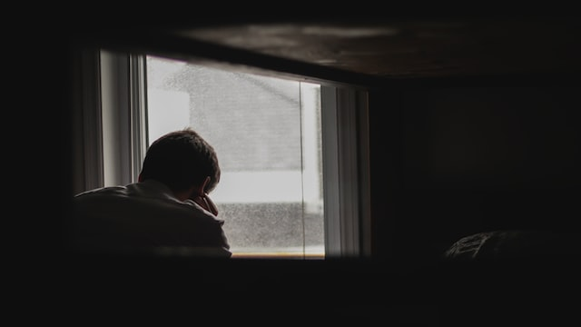

最近去公司上班了不到两周，果然还是逃不过Covid。中了后，在小房间闭关了一周多才转阴。症状也不是那么的轻微吧，发烧头痛还是难受了三四天，导致都开始爱上了吃Panadol后的感觉。加上空间狭小确实容易让人抑郁吧，有时候想着想着就怀疑人生。嗯，生日也是在隔离中一晃而过了。应该算是最平淡，又难忘的生日了吧。

没想到的是，快结束隔离了，肾结石又来访了。凌晨突然醒来，疼得想要呕吐，忍痛忍了几个小时，实在受不了就只身去急诊了。排队一个半小时后，终于等来护士拿着针头告诉我这是最强的止痛药了。下次我算知道了，Triage的时候问疼痛等级，0-10的范围就说等级100，我就不信还要排那么久。打完后，没想到屁股被扎得还挺痛的。疼了一小时，护士终于来告诉我可以拿药回家了。立马找护士确认，里面有止痛药吧。回家继续吃止痛药，希望疼痛不要再来一次。

接着晚上感觉呼吸不畅，也不知是止痛药的副作用，还是covid的后遗症。只好靠着口鼻一起呼吸了一晚上。第二天起来鼻子就堵了，更加觉得有点呼吸困难。想着要分心下，就一直刷着手机了，刷了Twitter，刷B站，刷了微博，刷小红书，刷到干眼症又加重了。去镜子里看一眼，满眼的血丝。令人欣慰的是眼睛的痛立马就让身体忘记掉了呼吸的问题。

经历了这些有什么新的想法了？嗯，没什么新的想法。身体是最重要的，其实是知道的。除了这个，也一直相信，刷社交媒体更加容易难受，且得不到什么东西。回想下最近都看了些什么？

## B站
好几个交通事故视频。几个客制键盘的视频。无聊的测评视频。

## 微博
日娃机智的开直播应对风波。FBI搜索了Trump豪宅。丁香园账号被禁。

## Twitter
移民中介鼓吹要移民。DID在Web3的重要性。Hackernews上有个讲TTY的英文文章是直接从中文翻译的。现代汽车代码里签名用的私钥是直接网上的教程里复制过去的。

上面这些内容，我得到了什么？眼里充满了血丝。