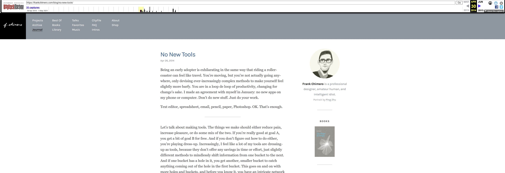

我们应该都碰到过，想查看收藏夹里的文章，但发现页面不存在了。然后试着去 Google 文章的标题，但是发现没有被全文转载。这个时候就可以考虑使用[Wayback Machine](https://archive.org/web/)了。

## 如何使用

### 方法一 - 手动查找
打开[Wayback Machine](https://archive.org/web/)，输入不存在页面的地址，比如 https://frankchimero.com/blog/no-new-tools/

可以通过时间线，选择最早被收录的时候。

一般，就可以看到当时的全文了。

### 方法二 - 使用官方插件
上面的方法还比较手动，不介意安装太多 Chrome 插件的话，可以用[官方的插件](https://chrome.google.com/webstore/detail/wayback-machine/fpnmgdkabkmnadcjpehmlllkndpkmiak)。

打开失效的页面时，插件会直接显示一个小红点，表示有找到存档的旧版本。直接点击查看就可以了！

## 总结
其实这个也是迫不得已才用的方法。对于感兴趣的页面，还是通过 Pocket，Instapaper，Raindrop 等服务收藏下吧。比如[Pocket](https://getpocket.com/)，收藏后就算用的免费版本也是一直用全文在的。如果怕 Pocket 倒掉，可以考虑使用 IFTTT，每次收藏到 Pocket 的时候，自动同步到 Instapaper。
